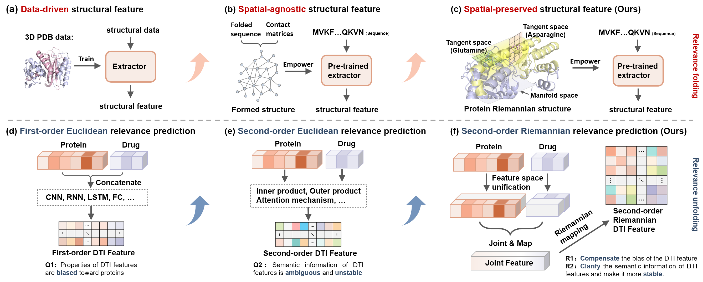

# R-DTI


## Installation
**Update**: Now the codes are compatible with PyTorch Geometric (PyG) >= 2.0.
### Dependency
The codes have been tested in the following environment:
Package  | Version
--- | ---
Python | 3.8.12
PyTorch | 1.10.1
CUDA | 11.3.1
PyTorch Geometric | **2.0.0**
RDKit | 2022.03
BioPython | 1.79
### Install via conda yaml file (cuda 11.3)

**Our model consists of two part: DTI prediction and Pretrained extractor**
## DTI prediction
Data_process: 

The original data is first processed by the code document "Predata.py";
              
Then, we can run main.py. This file will also import "merge.py" and "model.py";

The only thing we have to do is to write the data protocols and the save path;
              
```python
>>> data_select = "H_to_H"
>>> setting = "H_to_H"
>>> file_AUCs = 'output/result/AUCs--' + setting + '.txt'
>>> file_model = 'output/model/' + setting
```

The specific data protocols are described in the file "data_merge.py";

## Pretrained extractor

The source file of the pre-trained model is in "Representation.py", the model is trained with "train.py", and the hidden feature inference is done with "Inference.py".

